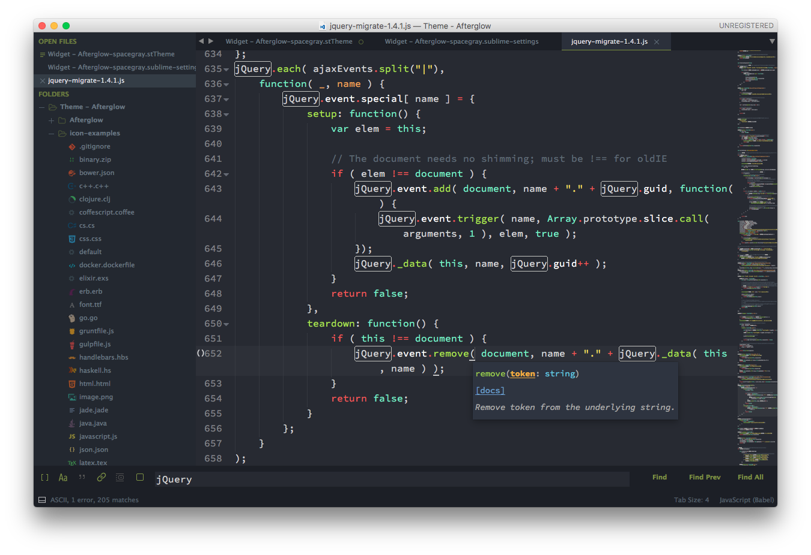

# Afterglow

Afterglow is a minimal dark Theme for Sublime Text 2 and 3. Also it is a syntax color scheme. The theme is based on the great theme [Spacegray](https://github.com/kkga/spacegray). The syntax color scheme is mostly derived from [idlefingers](http://idlefingers.co.uk/).

**Originally designed** by [@YabataDesign](https://github.com/YabataDesign). I composed it with theme [Spacegray](https://github.com/kkga/spacegray) and theme [itg.flat](https://github.com/itsthatguy/theme-itg-flat). And icons come from [Seti_UI](https://github.com/ctf0/Seti_ST3).

**Special thanks** to Max Riveiro [@kavu](https://github.com/kavu) for add a lot of icons for sidebar to this repository.

## Design & Colors

#### Afterglow spacegray



## Install

Locate your Sublime Text Packages directory by using the menu item Preferences -> Browse Packages....

Then, clone the repository using this command:

```
git clone https://github.com/idiotWu/afterglow-theme/ "Theme - Afterglow"
```

## Activating the Theme

Activate this theme and color scheme by modifying your user preferences file, which you can find using the menu item Sublime Text -> Preferences -> Settings - User.

Then add the following code settings, depending on the theme you choose. (After activating the theme, you must restart Sublime Text.)

```
{
    "theme": "Afterglow-spacegray.sublime-theme",
    "color_scheme": "Packages/Theme - Afterglow/Afterglow-itg.tmTheme"
}
```

## Warning

Some settings of original theme [Afterglow](https://github.com/YabataDesign/afterglow-theme) may be broken.

